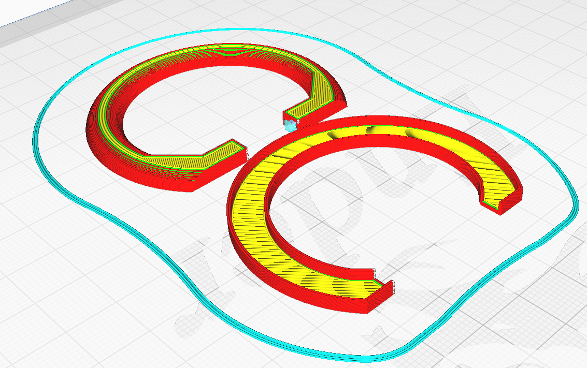

# Table of Content

1. [Bill of Material](#bill-of-material)
2. [Print Instructions](#print-instructions)
3. [Assembly Instruction](#assembly-instructions)
4. [Putting the Nose Ring on](#putting-the-nose-ring-on)

# Bill of Material
(Note: All of the link are **NOT** affiliated, I do not make money if you use these. Feel free to source your components elsewhere 😉)

 

| Item                                                                                             | Amount           | Price         |
| ------------------------------------------------------------------------------------------------ | ---------------- | ------------- |
| [Seeed Studio XIAO ESP32C3](https://vi.aliexpress.com/item/1005005382287176.html)                | 1                | GBP 3.80      |
| [M2*8 Screws](https://www.amazon.co.uk/dp/B09SD91HGC)                                            | 4                | GBP 0.09      |
| [White, Transparent or Glow In The Dark PLA (Nose Ring)](https://www.amazon.co.uk/dp/B0BPC7RCPT) | 4g               | GBP 0.08      |
| [Black PLA (Control box)](https://www.amazon.co.uk/dp/B08JG35BNP)                                | 10g              | GBP 0.20      |
| [Latching Push Button](https://www.amazon.co.uk/dp/B07BMNYJ13)                                   | 1                | GBP 0.20      |
| [JST 3 pin cable](https://vi.aliexpress.com/item/4000450837340.html)                             | 1 pair           | GBP 0.12      |
| [JST 2 pin cable](https://www.amazon.co.uk/gp/product/B08JVC4LVG)                                | 1 pair           | GBP 0.60      |
| [3.7V Li-ion 502030 Battery 250mAh](https://www.amazon.co.uk/dp/B08FD3V6TF)                      | 1                | GBP 7.00      |
| [4mm width or less high density LED Strip](https://vi.aliexpress.com/item/4000765540185.html)    | 30 Leds (approx) | GBP 2.00      |
| **TOTAL**                                                                                        | -                | **GBP 14.09** |

***Note:** All prices are withouth shipping cost, and the total doesn't reflect the electricity or labour expenses*

# Print Instructions
## Ring
Print the **NoseRingLED-Top** and **NoseRingLED-Bottom** files

Use White, Transparent or Glow in the Dark PLA Filament
The rings are very thin, so infill will not do anything.
For mine, I print the Top part with the hole facing the bed with support to make sure I get a good finish, and the Bottom flat on the bed

 

## Control Box
I recommend using PLA in black to blend with the muzzle, but you can use whatever you fancy.
Enable support everywhere for the USB port and the screws mount points

⚠ You might need to flip the model! Make sure to have the lid with the countersunk holes facing up, and the box flat on the bed

 

# Assembly Instructions
## Wiring

 

## WLED Setup
You can use anything you want for the control of your nose ring, even do custom code, but for the sake of simplicity, you can also just use WLED

[You can find installation instructions here](https://kno.wled.ge/basics/install-binary/)

Once installed, make sure you set the LED Strip length correctly (30 Leds if using my BOM), and the Data Pin (D2 is GPIO 4, so put 4 in there)

## Shoving it all in the box
1. Stick the wifi antenna to the bottom of the box 
2. Place the microcontroller upside down with the USB Port through the dedicated hole
3. Hotglue it into place to avoid having the controller be pushed back when plugging the USB in
4. Plug the battery + Push button on the JST connectro and put it where there is still some space sleft. Depending of the wire you are using, it might end up being a tight fit
5. Use super glue to put the push button through the cover hole. Feel free to use extra hotglue to keep it there
6. Feed the LED JST Connector out to be able to pug it to the ring later
7. Close the whole thing up and screw it in, **make sure you are not applying too much pressure on the battery or potentially puncturing it!**

 
 

## Making the LED Ring
The instruction will make it sound simple, but dealing with miniature electronics is a huge pain.
1. Cut the right amount of LED to fit the whole curve of the ring (it depends on your strip and cut line, but aim for slightly less just in case). For me it's 30 LEDs
2. Peel the adhesive back and glues it on the bottom part of the ring, holding for a few minutes until it fits.
3. Make sure to feed the wires through the back and keep them out for the next part
4. Still using some suber glue, press and glue the top part over it. Depending on the LED used, the fit is VERY tight, so you will want to hold it for a few minutes and touch up with more glue to make it stick.

# Putting the nose ring on
## Mr S Puppy Hood and Amazon/Aliexpress alternatives

 
 

The only thing you will need to do is add a bit of velcro tape on the inside of the muzzle. Use super glue as the adhesive tape on the velcro will not hold to neoprene.

You can then feed the nose ring cable and ring itself by stretching the nose holes a bit.

 
 

## Mr S K9 Hood and Frisky Hoods

 
 

For these, **you will have to put a hole on the backside of the muzzle to allow the nose ring cable to be fed through**. 

> ⚠ I cannot provie better instruction since I don't own (yet) these kind of hoods, so these are based of photos from friends and best attempt. Proceed with caution

While I tried to have as minimal of an impact on the hood, this is unfortunately unavoidable here, but the hole will be in the inside, so invisible, and just big enough to fit the JST connector

# ⚠ Caution
* Because of the way the SEEED Microcontroller battery posrt works, following my given instruction, you can only charge the device when it is on.
  > Any suggestion on making this better is welcomed 🙏

* Be **VERY CAREFUL** with the battery, it is a tiny and highly inflamable device very close to your face that can puff up and catch of fire if wired wrong. 
  * With flat cable and a bit of routing, you can probably power the contraption from an external battery.

* The device has not been tested for extended used over time, so I cannot assess if it will overheat, nor it's lifetime.